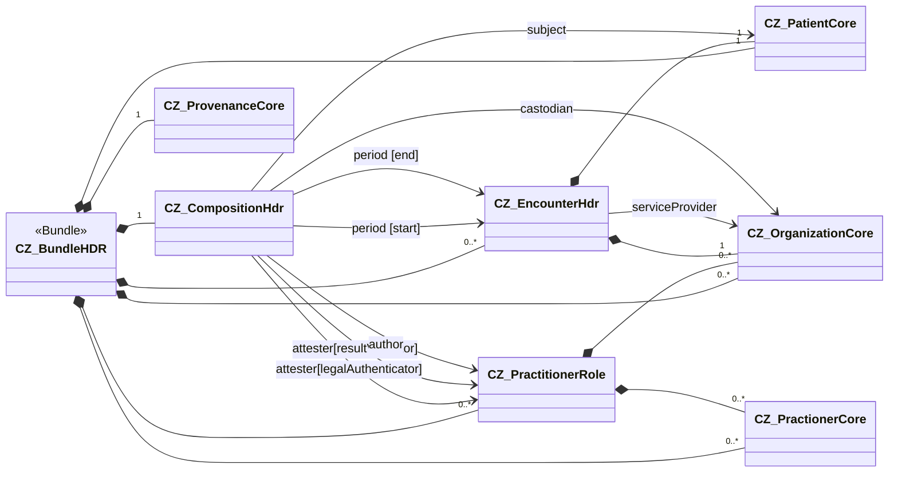

Na následující stránce naleznete poznámky k implementaci nemocniční propouštěcí zprávy. Týkají se tvorby kompozice a naplnění tohoto profilu příslušnými daty.

### Přehled

```mermaid
classDiagram
  direction LR
  class CZ_BundleHDR{
    <<Bundle>>
  }
  CZ_BundleHDR *-- "1" CZ_CompositionHdr
  CZ_BundleHDR *-- "1" CZ_PatientCore
  CZ_BundleHDR *-- "0..*" CZ_PractionerCore
  CZ_BundleHDR *-- "0..*" CZ_OrganizationCore
  CZ_BundleHDR *-- "0..*" CZ_EncounterHdr
  CZ_BundleHDR *-- "0..*" CZ_PractitionerRole
  CZ_BundleHDR *-- "1" CZ_ProvenanceCore
  CZ_PractitionerRole *-- "0..*" CZ_OrganizationCore
  CZ_PractitionerRole *-- "0..*" CZ_PractionerCore
  CZ_EncounterHdr *-- "1" CZ_PatientCore
  CZ_EncounterHdr *-- "1" CZ_OrganizationCore
  

  CZ_CompositionHdr --> CZ_PractitionerRole: attester[legalAuthenticator]
  CZ_CompositionHdr --> CZ_PractitionerRole: attester[resultValidator]
  CZ_CompositionHdr --> CZ_PractitionerRole: author
  CZ_CompositionHdr --> CZ_PatientCore: subject
  CZ_CompositionHdr --> CZ_EncounterHdr: period [start]
  CZ_CompositionHdr --> CZ_EncounterHdr: period [end]
  CZ_EncounterHdr --> CZ_OrganizationCore: serviceProvider
  CZ_CompositionHdr --> CZ_OrganizationCore: castodian

```

