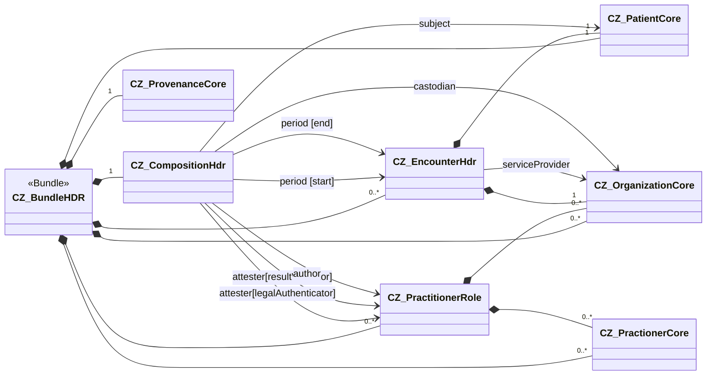

Na následující stránce naleznete poznámky k implementaci nemocniční propouštěcí zprávy. Týkají se tvorby kompozice a naplnění tohoto profilu příslušnými daty.

### Přehled

Cílem je sjednotit strukturování, validaci a zobrazování zdravotnických dat ve FHIR.  
Tento dokument je obecná šablona (např. pro propouštěcí zprávu, žádanky, nálezy) a slouží jako **implementační průvodce (Implementation Guide)**.

---

### Přehled kapitol

| Kapitola | Účel | Výstup / Artefakt |
|-----------|------|-------------------|
| **Logický model** | Klinická struktura obsahu dokumentu | Tabulka prvků (CZ/EN) |
| **Mapování** | Vazba logického modelu na FHIR elementy | Mapping table |
| **FHIR profily** | Formální omezení, kardinality, vazby a terminologie | StructureDefinition |
| **Obligations** | Funkční a zobrazovací povinnosti | ObligationDefinition |
| **Vzorové instance** | Referenční příklady a validní výstupy | Bundle a navázané Resource |
| **Doporučený postup** | Kroky pro implementaci a testování | Postup v rámci IG |

---

## 2. Logický model
**Účel:** Klinicky srozumitelný popis obsahu dokumentu, který tvoří základ pro technické mapování a validaci.  
**Jazyky:** CZ (pro čitelnost), EN (autorita pro mapování a profily).

Každý prvek obsahuje:
- Identifikátor prvku (pro mapování)
- Název (CZ/EN), popis
- Datový typ / charakter hodnoty

> Pozn.: EN verze logického modelu je **závazná** pro mapování a FHIR profily.

---

## 3. Mapování (Logical Model → FHIR)

### 3.1 Účel
Mapování definuje vztahy mezi prvky logického modelu (např. eHN Hospital Discharge Report) a odpovídajícími FHIR elementy v české implementační specifikaci (např. HDR CZ).  
Slouží k tomu, aby bylo jednoznačně určeno, **kam se jednotlivé položky logického modelu zapisují** v rámci FHIR struktury (`Composition`, `Bundle`, `Section` apod.).

### 3.2 Zásady mapování
- Každý prvek logického modelu musí být mapován na konkrétní FHIR element nebo skupinu elementů.  
- Pokud přímé mapování neexistuje, uvede se `Extension` nebo komentář s vysvětlením.  
- Mapování vychází z eHN HDR struktury (A.1 – Header, A.2 – Body) a rozvádí se do sekcí a podsekcí.  
- Každý řádek tabulky musí obsahovat buď vyplněný sloupec **Target Code**, nebo poznámku o způsobu řešení.  
- Vztah se vyjadřuje sloupcem **Relationship**, obvykle jako `is related to`.

---

### 3.3 Přehled mapování  
**CZ Hospital Discharge Report Model → CZ FHIR Implementation Guide**

#### Group 1 – Mapping from A – Hospital Discharge Report (eHN) → Bundle (HDR CZ)

| Source Code | Relationship | Target Code | Comment |
|--------------|---------------|--------------|----------|
| HospitalDischargeReport.header (A.1 – Hospital Discharge Report header data element) | is related to | Bundle | See the header model and map for details |

#### Group 2 – Mapping from A – Hospital Discharge Report (eHN) → Composition (HDR CZ)

| Source Code | Relationship | Target Code | Comment |
|--------------|---------------|--------------|----------|
| HospitalDischargeReport.body (A.2 – Hospital Discharge Report body data element) | is related to | Composition | See details below |
| HospitalDischargeReport.body.presentedForm (A.4 – Hospital Discharge Report in its narrative form) | is related to | Composition.extension:relatedArtefact.valueRelatedArtefact.document | Attachment (e.g. application/pdf) holding the presented form |
| HospitalDischargeReport.body.advanceDirectives (A.2.1 – Advance directives) | is related to | Composition.section:sectionAdvanceDirectives | Advance directives section |
| HospitalDischargeReport.body.alerts (A.2.2 – Alerts) | is related to | Composition.section:sectionAlert | See the Alerts model and map for details |
| HospitalDischargeReport.body.encounter (A.2.3 – Encounter) | is related to | Composition.encounter | See the InPatientEncounter model and map for details |
| HospitalDischargeReport.body.admissionEvaluation (A.2.4 – Admission evaluation) | is related to | Composition.section:sectionAdmissionEvaluation | Admission evaluation (with potential subsections) |
| HospitalDischargeReport.body.patientHistory (A.2.5 – Patient history) | is related to | Composition.section:sectionPatientHx | Narrative patient history section |
| HospitalDischargeReport.body.hospitalStay (A.2.6 – Course of hospitalisation (Hospital stay)) | is related to | Composition.section:sectionHospitalCourse | Hospital course narrative + entries |
| HospitalDischargeReport.body.dischargeDetails (A.2.7 – Discharge details) | is related to | Composition.section:sectionDischargeDetails | Container for discharge subsections and narrative |
| HospitalDischargeReport.body.dischargeDetails.objectiveFindings (A.2.7.1 – Objective findings) | is related to | Composition.section:sectionDischargeDetails.section:sectionPhysicalExamination |  |
| HospitalDischargeReport.body.dischargeDetails.functionalStatus (A.2.7.2 – Functional status) | is related to | Composition.section:sectionDischargeDetails.section:sectionFunctionalStatus |  |
| HospitalDischargeReport.body.dischargeDetails.dischargeNote (A.2.7.3 – Discharge note) | is related to | Composition.section:sectionDischargeDetails |  |
| HospitalDischargeReport.body.recommendations (A.2.8 – Care plan and other recommendations after discharge) | is related to | Composition.section | Potentially covered by several sections |
| HospitalDischargeReport.body.recommendations.carePlan (A.2.8.1 – Care plan) | is related to | Composition.section:sectionPlanOfCare |  |
| HospitalDischargeReport.body.recommendations.medicationSummary (A.2.8.2 – Medication summary) | is related to | Composition.section:sectionPharmacotherapy | CZ guide uses Pharmacotherapy section; use Discharge Medications if present in jurisdiction |

---

### 3.4 Poznámky k lokálním úpravám
- Mapování vychází z modelu eHN HDR v části A.2.  
- V české implementaci se používají pojmenované sekce dle `Composition.section:sectionXXX`.  
- Názvy sekcí (např. `sectionPharmacotherapy`, `sectionHospitalCourse`) odpovídají profilům definovaným v této implementační specifikaci.  
- V případě neexistence odpovídajícího FHIR elementu lze využít `Extension` s popisem ve sloupci Comment.  
- Mapování může být podkladem pro generování `ConceptMap` artefaktů nebo pro automatickou validaci v rámci testovacích scénářů.

---

## 4. FHIR profily
**Účel:** Zpřesňují použití FHIR resource v českém kontextu (omezují volitelnost, sjednocují praxi) a doplňují terminologické bindingy.

### 4.1 Struktura profilu
- Základní resource (např. `Composition`, `Patient`, `Encounter`, …)  
- Kardinality (např. `Composition.author 1..1`, `section 1..*`)  
- Vazby mezi profily (např. `Composition.section` → `Condition`)  
- Odkazy na použitou terminologii (ValueSet, CodeSystem, Binding strength)

### 4.2 Kardinalita
- **Povinné:** `1..1`  
- **Volitelné:** `0..1`  
- **Opakovatelné:** `0..*` / `1..*`  
> Národní profily mohou být **přísnější** než evropské.

### 4.3 Terminologické vazby
Každý profil využívá závazné nebo doporučené číselníky:
- **required** – musí být z daného ValueSetu,  
- **extensible** – primárně z ValueSetu, případně rozšíření,  
- **preferred** – doporučený ValueSet, ale nevyžadovaný.  

> Příklady: `Composition.type` – LOINC `34105-7`, `Condition.code` – ICD-10/SNOMED CT, `Observation.unit` – UCUM.

---

## 5. Obligations (Povinnosti)

> **Informativní pro tuto verzi průvodce**  
> Do této verze příručky byly přidány závazná pravidla pouze jako informativní materiál ke shromažďování zpětné vazby o jejich používání.

### 5.1 Přehled a terminologie
Závazná pravidla (**Obligations**) specifikují schopnosti a chování, které definovaní aktéři **MAY** (MOHOU), **SHOULD** (MĚLI BY) nebo **SHALL** (MUSÍ) implementovat v rámci uvedených FHIR profilů.  
Obligations doplňují kardinality a terminologické bindingy všude tam, kde samotná struktura nestačí (např. požadavky na uživatelské funkce, workflow nebo povinné zobrazení vybraných položek).

### 5.2 Úrovně plnění (L1–L3)
- **L1** – *nestrukturovaný dokument*: povinná metadata dokumentu + lidsky čitelný PDF výstup.  
- **L2** – *strukturované sekce*: dokument členěný do identifikovatelných sekcí, obsah je převážně narativní.  
- **L3** – *strukturované + kódované*: stejné sekce jako L2; vybrané informace **SHALL** být ve formalizované a kódované podobě.

### 5.3 Aktéři
- **Tvůrce úrovně L1** – vytváří L1 zprávu (odeslání konzumentovi / uložení do repozitáře).  
- **Konzument úrovně L1** – přijímá/načítá a používá L1 zprávu.  
- **Tvůrce úrovně L2** – vytváří L2 zprávu (sekce, narativ).  
- **Konzument úrovně L2** – zpracovává L2 zprávu.  
- **Tvůrce úrovně L3** – vytváří L3 zprávu (formální + kódované prvky).  
- **Konzument úrovně L3** – zpracovává L3 zprávu včetně formálních/kódovaných prvků.

> Diagram aktérů: `hdr-Actors-cs.svg`

### 5.4 Typy závazných pravidel
- **Creator obligations** – povinnosti pro **tvorbu** dokumentu (systémové/UX chování).  
  - Příklad: Tvůrce **SHALL** umožnit výběr a uložení autora/atestátora propouštěcí zprávy.
- **Consumer obligations** – povinnosti pro **zobrazení** v prohlížečích/konzumentech.  
  - Příklad: Konzument **SHALL** zobrazit `Composition.title`, `Composition.date` a `Composition.author`; jazyk dokumentu **MAY** být nezobrazen.

### 5.5 Vazba na profily a testování
Každé závazné pravidlo (Obligation) je svázáno s konkrétním profilem nebo skupinou profilů, které doplňuje.  
Obligations se uplatňují v testovacích scénářích validace – např. při kontrole správného zobrazení sekcí nebo existence povinných funkcí při tvorbě dokumentu.

---

## 6. Vzorové instance (Examples)

**Účel:**  
Příklady slouží jako **referenční implementace**, která ukazuje, jak mají vypadat **plně validní výstupy** pro jednotlivé profily a úrovně zralosti (**L1–L3**) datové struktury.  
Nejedná se pouze o ukázku `Bundle`, ale o **kompletní sadu vzájemně provázaných FHIR resource**, které reprezentují reálný klinický dokument včetně všech potřebných referencí.

### 6.1 Obsah a struktura příkladů
Každý příklad:
- odpovídá konkrétnímu profilu (např. `CZ_CompositionHdr`, `CZ_ConditionHdr`, `CZ_PatientCore`),  
- reflektuje závazná pravidla (Obligations) a kardinality profilu,  
- využívá příslušné číselníky a terminologické bindingy (LOINC, SNOMED CT, ICD-10, UCUM),  
- je validní vůči definovanému profilu v rámci implementační příručky.

### 6.2 Úrovně zralosti datové struktury

| Úroveň | Obsah příkladu | Struktura | Použití |
|---------|----------------|------------|----------|
| **L1** | PDF + metadata | `Composition`, `DocumentReference` | Minimální interoperabilita |
| **L2** | Sekce + text | `Composition.section` | Strukturovaný narativ |
| **L3** | Kódované položky | `Composition.section` + `Condition`, `Medication`, … | Strojová interoperabilita |

### 6.3 Typická sada resource pro příklad propouštěcí zprávy
- `Composition` – hlavička a sekce dokumentu  
- `Patient` – identifikace pacienta  
- `Encounter` – hospitalizační epizoda  
- `Condition` – diagnózy (včetně hlavní diagnózy)  
- `Procedure` – významné výkony a zákroky  
- `MedicationStatement`, `MedicationRequest`, `MedicationDispense` – informace o léčbě  
- `AllergyIntolerance` – alergie a intolerance  
- `Observation` – klíčové nálezy, výsledky, fyziologické hodnoty  
- `DocumentReference` – vložená PDF/narativní rendice  
- Další navázané resource dle profilu (např. `Consent`, `Organization`, `PractitionerRole`)

### 6.4 Cíl příkladů
Příklady mají sloužit:
- **implementátorům** jako referenční model validní instance pro testování,  
- **tvůrcům a konzumentům** (L1–L3) jako ukázka rozsahu dat, které mají být dostupné,  
- **testovacím scénářům** jako základ pro automatickou validaci proti profilům a závazným pravidlům (*Obligations*).

### 6.5 Validace příkladů
Každý příklad musí být validní vůči příslušnému profilu (`StructureDefinition`) a mít správně navázané reference mezi resource.  
Validaci lze provést pomocí nástroje **FHIR Validator**, IG Publisheru nebo jiného validačního rámce.  
> Doporučuje se zahrnout validaci do testovací pipeline (např. CI/CD) jako kontrolu souladu s profily.
