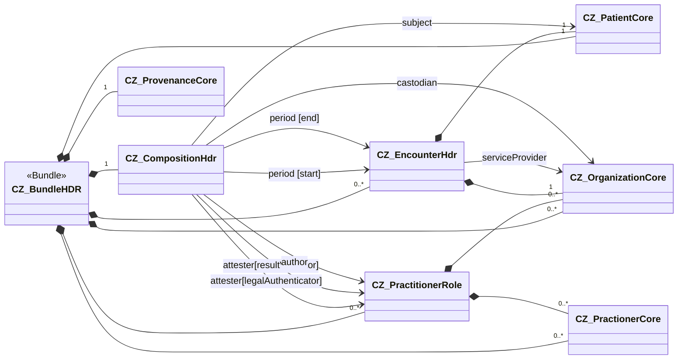

On the following page, you will find notes on the implementation of the hospital discharge summary.  
They cover the composition creation and the population of this profile with corresponding data.

### Overview

The goal is to harmonize the **structuring, validation, and visualization** of healthcare data in FHIR.  
This document serves as a **general template** (e.g., for discharge summaries, referrals, findings) and acts as an **Implementation Guide (IG)**.

---

### Chapter Overview
| Chapter | Purpose | Output / Artifact |
|----------|----------|-------------------|
| **Logical Model** | Clinical structure of the document content | Table of elements (CZ/EN) |
| **Mapping** | Relationship between logical model and FHIR elements | Mapping table |
| **FHIR Profiles** | Formal constraints, cardinalities, references, and terminology bindings | StructureDefinition |
| **Obligations** | Functional and display requirements | ObligationDefinition |
| **Example Instances** | Reference examples and valid outputs | Bundle and linked Resources |
| **Recommended Procedure** | Implementation and testing steps | Workflow within the IG |

---

## 2. Logical Model
**Purpose:** Clinically understandable description of the document content that forms the basis for technical mapping and validation.  
**Languages:** CZ (for readability), EN (authoritative for mapping and profiles).

Each element contains:
- Element identifier (for mapping)
- Name (CZ/EN), description
- Data type / value characteristics

> Note: The English version of the logical model is **binding** for mapping and FHIR profiles.

---

## 3. Mapping (Logical Model → FHIR)

### 3.1 Purpose
Mapping defines relationships between elements of the logical model (e.g., eHN Hospital Discharge Report) and the corresponding FHIR elements in the Czech implementation guide (e.g., HDR CZ).  
It ensures that **each item of the logical model is unambiguously represented** within the FHIR structure (`Composition`, `Bundle`, `Section`, etc.).

### 3.2 Mapping Principles
- Every element of the logical model must be mapped to a specific FHIR element or group of elements.  
- If direct mapping does not exist, an `Extension` or explanatory comment must be provided.  
- Mapping is based on the eHN HDR structure (A.1 – Header, A.2 – Body) and expanded into sections and subsections.  
- Each row in the table must contain either a populated **Target Code** column or a comment explaining the handling.  
- The relationship is expressed in the **Relationship** column, typically as `is related to`.

---

### 3.3 Mapping Overview  
**CZ Hospital Discharge Report Model → CZ FHIR Implementation Guide**

#### Group 1 – Mapping from A – Hospital Discharge Report (eHN) → Bundle (HDR CZ)
| Source Code | Relationship | Target Code | Comment |
|--------------|---------------|--------------|----------|
| HospitalDischargeReport.header (A.1 – Hospital Discharge Report header data element) | is related to | Bundle | See the header model and map for details |

#### Group 2 – Mapping from A – Hospital Discharge Report (eHN) → Composition (HDR CZ)
| Source Code | Relationship | Target Code | Comment |
|--------------|---------------|--------------|----------|
| HospitalDischargeReport.body (A.2 – Hospital Discharge Report body data element) | is related to | Composition | See details below |
| HospitalDischargeReport.body.presentedForm (A.4 – Hospital Discharge Report in its narrative form) | is related to | Composition.extension:relatedArtefact.valueRelatedArtefact.document | Attachment (e.g., application/pdf) holding the presented form |
| HospitalDischargeReport.body.advanceDirectives (A.2.1 – Advance directives) | is related to | Composition.section:sectionAdvanceDirectives | Advance directives section |
| HospitalDischargeReport.body.alerts (A.2.2 – Alerts) | is related to | Composition.section:sectionAlert | See the Alerts model and map for details |
| HospitalDischargeReport.body.encounter (A.2.3 – Encounter) | is related to | Composition.encounter | See the InPatientEncounter model and map for details |
| HospitalDischargeReport.body.admissionEvaluation (A.2.4 – Admission evaluation) | is related to | Composition.section:sectionAdmissionEvaluation | Admission evaluation (with potential subsections) |
| HospitalDischargeReport.body.patientHistory (A.2.5 – Patient history) | is related to | Composition.section:sectionPatientHx | Narrative patient history section |
| HospitalDischargeReport.body.hospitalStay (A.2.6 – Course of hospitalisation (Hospital stay)) | is related to | Composition.section:sectionHospitalCourse | Hospital course narrative + entries |
| HospitalDischargeReport.body.dischargeDetails (A.2.7 – Discharge details) | is related to | Composition.section:sectionDischargeDetails | Container for discharge subsections and narrative |
| HospitalDischargeReport.body.dischargeDetails.objectiveFindings (A.2.7.1 – Objective findings) | is related to | Composition.section:sectionDischargeDetails.section:sectionPhysicalExamination |  |
| HospitalDischargeReport.body.dischargeDetails.functionalStatus (A.2.7.2 – Functional status) | is related to | Composition.section:sectionDischargeDetails.section:sectionFunctionalStatus |  |
| HospitalDischargeReport.body.dischargeDetails.dischargeNote (A.2.7.3 – Discharge note) | is related to | Composition.section:sectionDischargeDetails |  |
| HospitalDischargeReport.body.recommendations (A.2.8 – Care plan and other recommendations after discharge) | is related to | Composition.section | Potentially covered by several sections |
| HospitalDischargeReport.body.recommendations.carePlan (A.2.8.1 – Care plan) | is related to | Composition.section:sectionPlanOfCare |  |
| HospitalDischargeReport.body.recommendations.medicationSummary (A.2.8.2 – Medication summary) | is related to | Composition.section:sectionPharmacotherapy | CZ guide uses Pharmacotherapy section; use Discharge Medications if present in jurisdiction |

---

### 3.4 Notes on Local Adaptations
- The mapping is based on the eHN HDR model (section A.2).  
- The Czech implementation uses named sections according to `Composition.section:sectionXXX`.  
- Section names (e.g., `sectionPharmacotherapy`, `sectionHospitalCourse`) correspond to profiles defined in this implementation guide.  
- If a corresponding FHIR element does not exist, an `Extension` may be used, described in the Comment column.  
- The mapping can serve as the basis for generating `ConceptMap` artifacts or for automated validation in test scenarios.

---

## 4. FHIR Profiles
**Purpose:** Refine the use of FHIR resources in the Czech context (restrict optionality, unify practice) and define terminology bindings.

### 4.1 Profile Structure
- Base resource (e.g., `Composition`, `Patient`, `Encounter`, …)  
- Cardinalities (e.g., `Composition.author 1..1`, `section 1..*`)  
- Relationships between profiles (e.g., `Composition.section` → `Condition`)  
- References to terminology bindings (ValueSet, CodeSystem, Binding strength)

### 4.2 Cardinality
- **Mandatory:** `1..1`  
- **Optional:** `0..1`  
- **Repeatable:** `0..*` / `1..*`  
> National profiles may be **more restrictive** than European ones.

### 4.3 Terminology Bindings
Each profile uses mandatory or recommended code systems:
- **required** – must come from the specified ValueSet,  
- **extensible** – primarily from the ValueSet, may extend when justified,  
- **preferred** – recommended ValueSet, not mandatory.  

> Examples: `Composition.type` – LOINC `34105-7`, `Condition.code` – ICD-10/SNOMED CT, `Observation.unit` – UCUM.

---

## 5. Obligations

> **Informative in this version of the guide**  
> In this release, binding rules are included only as informative material to collect feedback on their applicability.

### 5.1 Overview and Terminology
Binding rules (**Obligations**) specify the capabilities and behaviors that defined actors **MAY**, **SHOULD**, or **SHALL** implement within the referenced FHIR profiles.  
Obligations complement cardinalities and terminology bindings wherever structure alone is insufficient (e.g., user interface requirements, workflow logic, or mandatory display of certain data elements).

### 5.2 Compliance Levels (L1–L3)
- **L1** – *Unstructured document*: mandatory document metadata + human-readable PDF output.  
- **L2** – *Structured sections*: document divided into identifiable sections, primarily narrative content.  
- **L3** – *Structured + coded*: same sections as L2; selected information **SHALL** be formalized and coded.

### 5.3 Actors
- **L1 Creator** – creates L1 document (submits to consumer / repository).  
- **L1 Consumer** – receives/loads and uses L1 document.  
- **L2 Creator** – creates L2 document (sections, narrative).  
- **L2 Consumer** – processes L2 document.  
- **L3 Creator** – creates L3 document (structured + coded elements).  
- **L3 Consumer** – processes L3 document including coded elements.

> Actor diagram: `hdr-Actors-cs.svg`

### 5.4 Types of Obligations
- **Creator obligations** – requirements for **document creation** (system/UX behavior).  
  - Example: The creator **SHALL** allow selection and recording of author/attester of the discharge summary.  
- **Consumer obligations** – requirements for **display** in viewers/consumers.  
  - Example: The consumer **SHALL** display `Composition.title`, `Composition.date`, and `Composition.author`; document language **MAY** be omitted.

### 5.5 Relation to Profiles and Testing
Each obligation is linked to a specific profile or profile group it extends.  
Obligations are applied in validation test scenarios – e.g., verifying correct section display or the existence of required functions during document creation.

---

## 6. Example Instances

**Purpose:**  
Examples serve as **reference implementations**, demonstrating what **fully valid outputs** look like for each profile and data structure maturity level (**L1–L3**).  
They represent not only a `Bundle` example but a **complete set of interlinked FHIR resources** forming a realistic clinical document with all necessary references.

### 6.1 Example Content and Structure
Each example:
- corresponds to a specific profile (e.g., `CZ_CompositionHdr`, `CZ_ConditionHdr`, `CZ_PatientCore`),  
- reflects defined obligations and profile cardinalities,  
- uses appropriate code systems and terminology bindings (LOINC, SNOMED CT, ICD-10, UCUM),  
- validates successfully against the respective profile within the Implementation Guide.

### 6.2 Data Structure Maturity Levels
| Level | Example Content | Structure | Usage |
|--------|------------------|------------|--------|
| **L1** | PDF + metadata | `Composition`, `DocumentReference` | Minimal interoperability |
| **L2** | Sections + narrative text | `Composition.section` | Structured narrative |
| **L3** | Coded entries | `Composition.section` + `Condition`, `Medication`, … | Machine interoperability |

### 6.3 Typical Resource Set for a Discharge Summary Example
- `Composition` – document header and sections  
- `Patient` – patient identification  
- `Encounter` – hospitalization episode  
- `Condition` – diagnoses (including principal diagnosis)  
- `Procedure` – significant procedures and interventions  
- `MedicationStatement`, `MedicationRequest`, `MedicationDispense` – treatment information  
- `AllergyIntolerance` – allergies and intolerances  
- `Observation` – key findings, results, physiological measurements  
- `DocumentReference` – embedded PDF/narrative rendition  
- Additional related resources per profile (e.g., `Consent`, `Organization`, `PractitionerRole`)

### 6.4 Example Objectives
Examples are intended to serve:
- **Implementers** – as reference models of valid instances for testing,  
- **Creators and Consumers** (L1–L3) – as illustrations of expected data scope,  
- **Test Scenarios** – as input for automated validation against profiles and obligations.

### 6.5 Example Validation
Each example must validate against the corresponding `StructureDefinition` and contain correctly linked references among resources.  
Validation can be performed using **FHIR Validator**, IG Publisher, or another validation framework.  
> It is recommended to include validation within the test pipeline (e.g., CI/CD) as a compliance check with the profiles.
